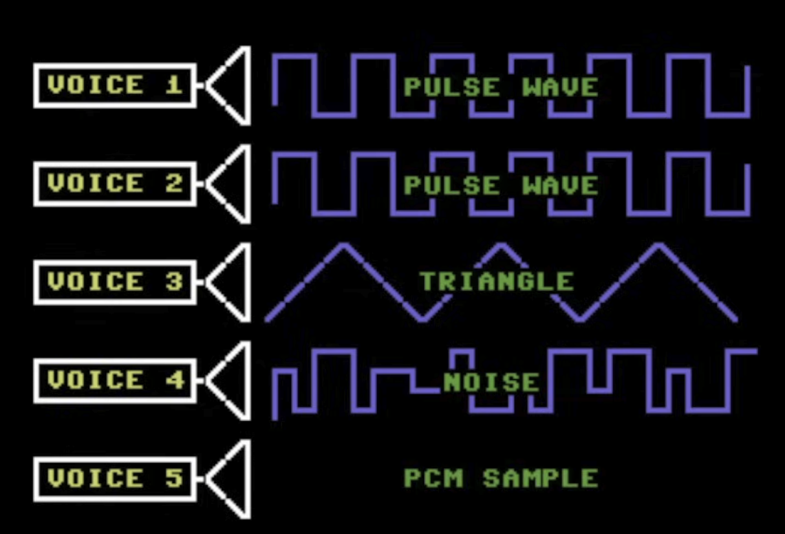

  

# Ochoit

Ochoit is a browser-based 8-bit music workstation for sketching NES-inspired loops with five voices: two pulse channels, triangle, noise, and PCM samples.

[Run locally](docs/running-locally.md)

## Why I Built It

I got inspired by [8bitcn](https://www.8bitcn.com) and [soundcn](https://www.soundcn.xyz) and started wondering how 8-bit music was actually made and [how the old console sound hardware worked](https://www.youtube.com/watch?v=q_3d1x2VPxk).

That led me to the NES audio setup: five voices, with the first two handling pulse waves, the third using a triangle wave, the fourth generating noise, and the fifth acting as a sampler. Once I understood that layout, building a browser sequencer around it sounded fun.

So Ochoit became a fully browser-based workstation where you can sketch your own retro-flavored loops, record or import tiny PCM sounds, export a WAV, or share a link to a song on social media.

The PCM channel was especially fun to explore. I was a little disappointed that it was not used more often in NES game music, but that made me want to lean into it. Part of that inspiration came from Charlie Puth building musical ideas out of everyday sounds, like the spoon-and-mug bit on [The Tonight Show](https://www.youtube.com/watch?v=6gTmyhRM6k0). So yes, you can do that here too.

## Feature Highlights

- Five-voice workstation with pulse I, pulse II, triangle, noise, and PCM tracks
- Microphone recorder for short sample capture
- Trim controls and base-note mapping for PCM clips
- Example songs for fast onboarding
- Shareable song links and a text-based song DSL

## Disclaimer
This is just a fun project I just want to build for myself, and thanks to AI if you can think of it, you can probably build it too. This project was made entirely using codex (And Opus 4.6 to fix the sh*tty UI made by GPT-5.4).
